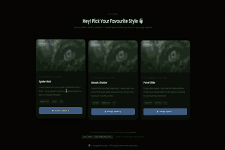

# Atamagula — Glass Shatter Intro Animation

A full-screen intro animation for websites. A frosted glass overlay covers an eye image — tap anywhere to shatter the glass, the eye zooms in, screen darkens, then a second image fades in and the page navigates to the home page.

---

## Preview

**Pattern A — Spider Web**


▶ [Watch full video on YouTube](https://youtu.be/SXiXI33TPZ4)

**Pattern B — Mosaic Shatter**



▶ [Watch full video on YouTube](https://youtu.be/fiMybmRJwZ8)

**Pattern C — Panel Slide**


▶ [Watch full video on YouTube](https://youtu.be/SFGUC4nA2Rc)

Open `demo/index.html` in your browser to choose from 3 patterns:

| Pattern | Style | Description |
|---|---|---|
| A — Spider Web | Radial cracks | 18 rays spread from the tap point in concentric rings |
| B — Mosaic Shatter | Triangular tiles | Irregular triangle grid ripples outward from tap |
| C — Panel Slide | Large panels | 6 big glass panels fall away dramatically |

---

## How to Run (Local)

No server, no install needed in most cases.

1. Double-click `demo/glass-a.html` (or b / c) and open in **Chrome**
2. If you see the frosted glass — you're good, no server needed
3. If you get a black screen — run a simple local server:

```bash
# Python (already on most machines)
cd "path/to/this-folder"
python -m http.server 5500
# then open http://localhost:5500/demo/
```

Or use the **VS Code Live Server** extension — right-click `demo/index.html` → Open with Live Server.

---

## How to Customise

### 1. Swap the images

| File | What it is |
|---|---|
| `1.png` | The eye image shown under the frosted glass |
| `2.png` | The image that fades in after the zoom |

Replace these two files with your own images. Keep the same filenames, or update the `src` in the HTML:

```html


```

### 2. Set your home page URL

Open your chosen pattern file (e.g. `demo/glass-a.html`) and find **line 40**:

```js
const HOME = 'YOUR_HOME_PAGE_URL';
```

Replace with your actual URL:

```js
const HOME = 'https://yourwebsite.com/';
```

That's it. One line change.

### 3. Choose a pattern

Pick whichever of the 3 patterns she likes. You only need that one file — `glass-a.html`, `glass-b.html`, or `glass-c.html`.

---

## How to Add to a PHP / WordPress Site

1. Copy your chosen glass file (e.g. `glass-a.html`) into your project root — rename to `intro.php` if you like (no PHP code needed inside)
2. Copy `1.png` and `2.png` into the same folder and update the image `src` paths if needed
3. Set `const HOME = 'https://yourwebsite.com/';`
4. Link to this page as your landing/entry point

**WordPress:** Go to *Settings → Reading*, set "Your homepage displays" to a Static Page, create a page called "Intro", and use a full-width template with this HTML embedded.

---

## Show Only Once Per User

Add these two snippets to the glass file.

**Right after `const HOME = '...';` — paste this:**

```js
// Skip intro if already seen this session
if(sessionStorage.getItem('intro_seen')){ location.replace(HOME); }
```

**At the top of the `fade()` function — add one line:**

```js
function fade(){
  sessionStorage.setItem('intro_seen', '1'); // ← add this
  // rest of fade() stays the same...
```

To make it permanent across sessions (never shows again on that device), swap `sessionStorage` for `localStorage`.

> **Reset during testing:** DevTools → Application → Local Storage (or Session Storage) → delete the `intro_seen` key.

---

## File Structure

```
├── 1.png                  eye image (frosted glass layer)
├── 2.png                  second image (revealed after zoom)
└── demo/
    ├── index.html         pattern chooser page
    ├── home.html          integration guide
    ├── glass-a.html       Pattern A — Spider Web
    ├── glass-b.html       Pattern B — Mosaic Shatter
    └── glass-c.html       Pattern C — Panel Slide
```

---

## Animation Timing

| Phase | Duration |
|---|---|
| Glass shatters | ~1.4 – 1.7 s |
| Eye zooms in + darkens | ~1.8 s |
| Second image fades in | ~1.9 s |
| Hold on second image | 2 s |
| Navigate to home page | — |

Total: ~7 seconds from tap to navigation.

---

Built with plain HTML / CSS / Canvas — no frameworks, no dependencies.
